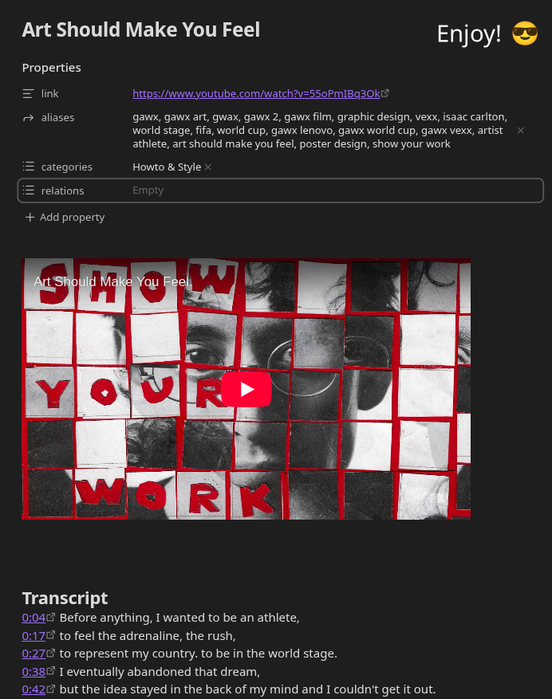

  <h1 align="center">🎥 Clip YouTube Videos in Obsidian 🎥</h1>
    

      
    

Transcribe YouTube videos directly into Obsidian notes with one click.

Based on the [forum discussion](https://forum.obsidian.md/t/web-clipper-youtube-video-transcript-for-yts-ui-feb-2026-update/111550/7), this template unifies all selectors for seamless integration.

# Installation

## 💄 STEP 0 - Choose your template style

  <h3>Raw Transcription</h3>
  

  <h3>Timestamps</h3>
  

## ⬇️ Download & Install Template

## 🔧 STEP 1 - Enable Auto-Transcript

After installing the template, you need the transcription tab to open automatically. We'll use the YouTube Tweaks browser extension for this.

<h4 align="center">🌐 Install YouTube Tweaks:</h4>

  
  
  

## ⚙️ STEP 2 - Configure YouTube Tweaks

  
  

## STEP 3 - Be Happy 😁

### 🤝 Contributing

You are welcome to submit a pull request making your own version for the community. ✨

### 🔥 Troubleshooting

YouTube updates selectors periodically — we patch as fast as possible.
