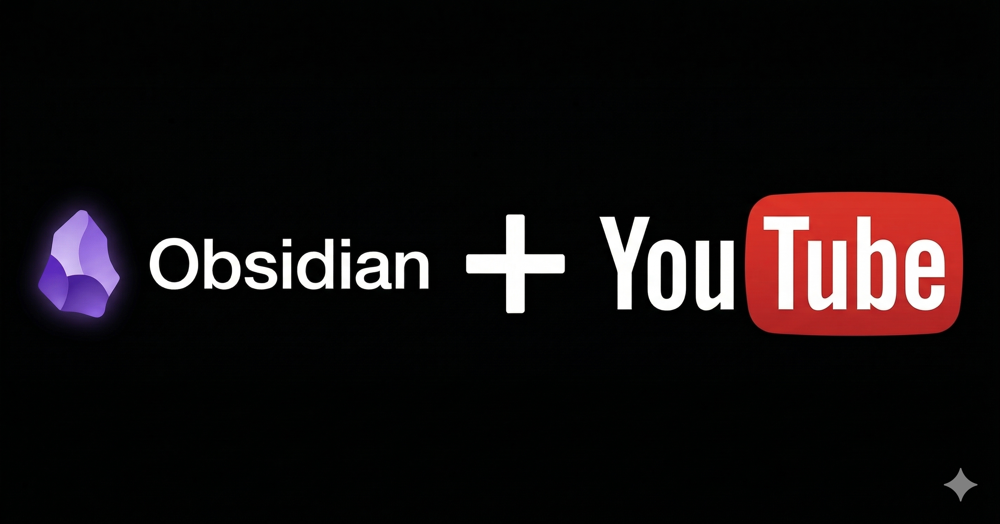
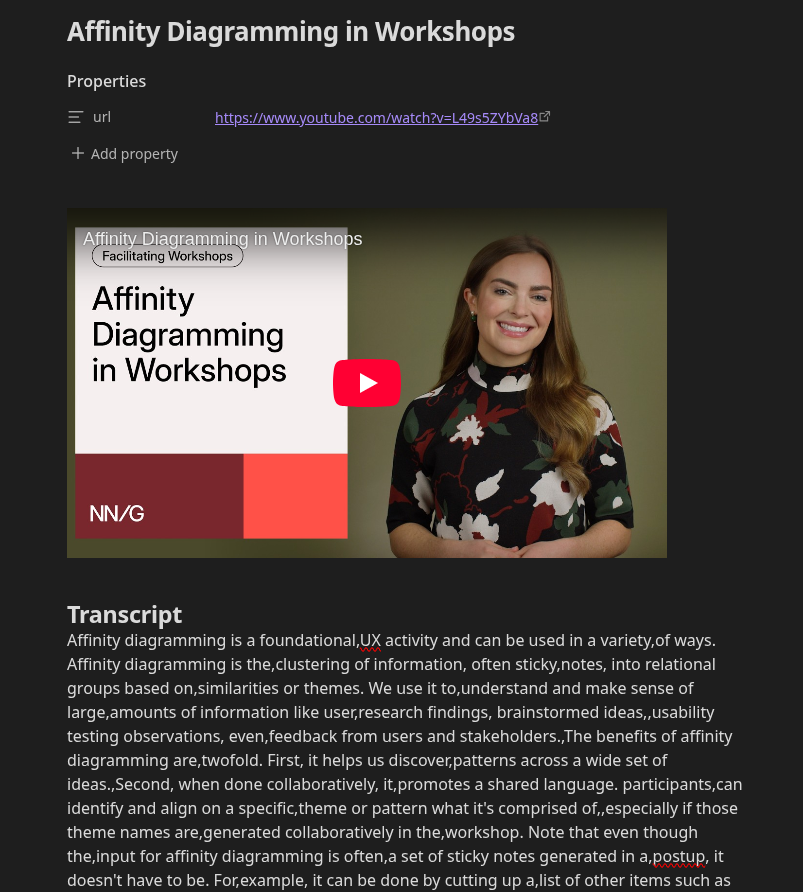
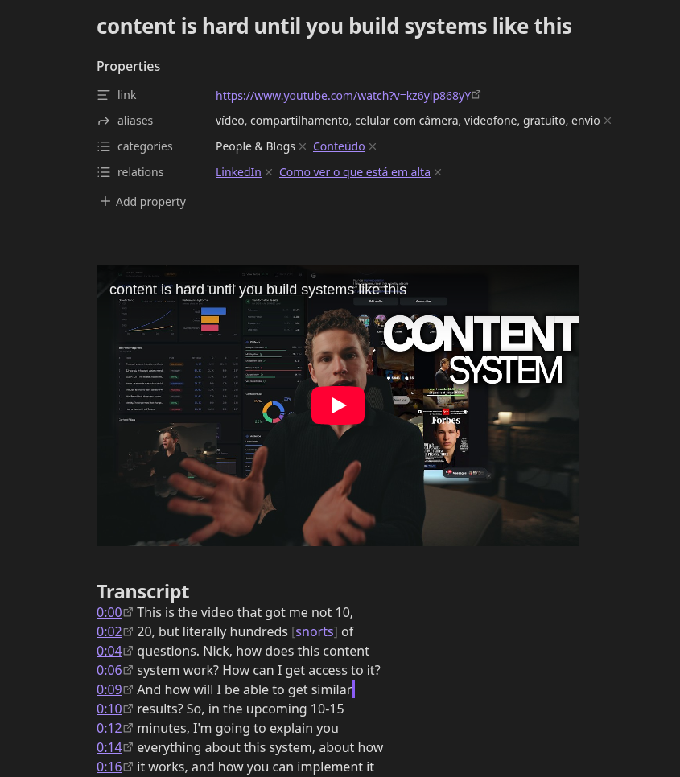
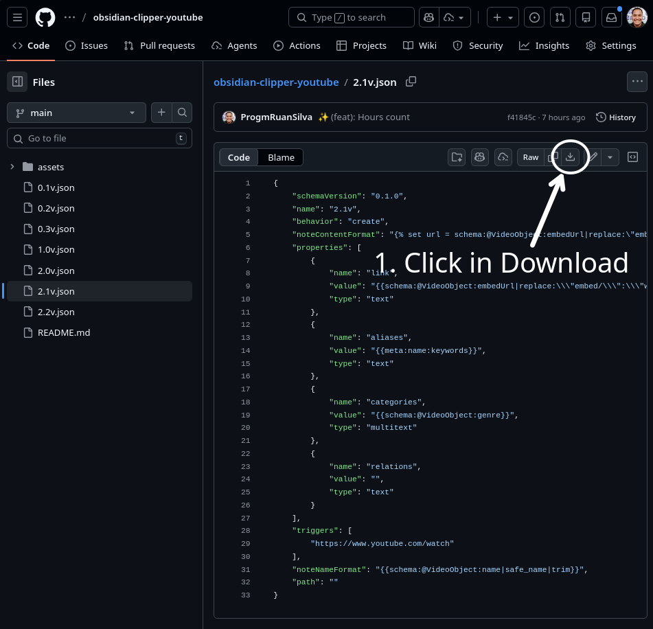
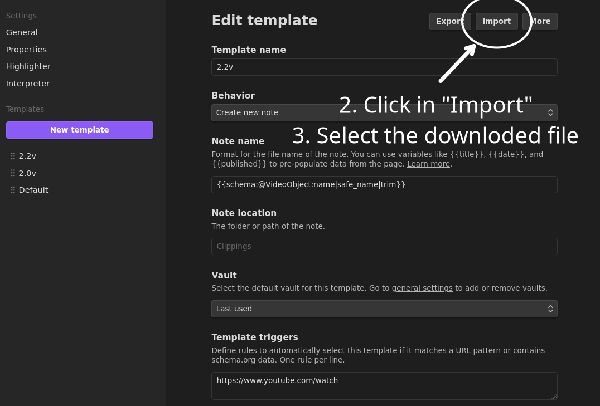
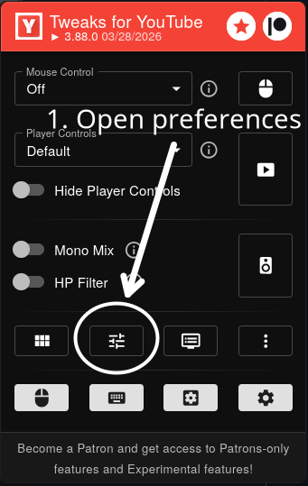
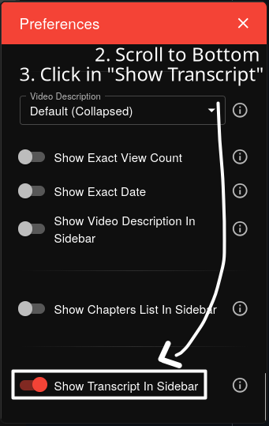

  <h1 align="center">✨ Obsidian Clipper YouTube Videos ✨</h1>
    

      
    

This plugin adds the ability to transcribe YouTube videos into notes. It also adds a new note type for YouTube videos.

Based in the [forum discussion](https://forum.obsidian.md/t/web-clipper-youtube-video-transcript-for-yts-ui-feb-2026-update/111550/7) I made a template to unify all selectors at once for anyone who wants to use it.

## Installation

#### STEP 0 - Choosing your template style

  <h3>Raw Transcription</h3>
  

  <h3>Timestamps</h3>
  

## Downloading the Selected Template

#### STEP 1 - Open transcribe section automatically

After the template installation you need to open the transcription tab aways, you could have you own code or find aother solution for it, I'll explain using YouTube Tweaks plugin.
<h4 align="center">Install YouTube Tweaks in your browser:</h4>

  
  
  

#### STEP 2 - YouTube Tweaks Setup

  
  

### Contrubuiting

### Troubleshooting

YouTube changes the selectors periodicaly, we upate every time but can be delayed
